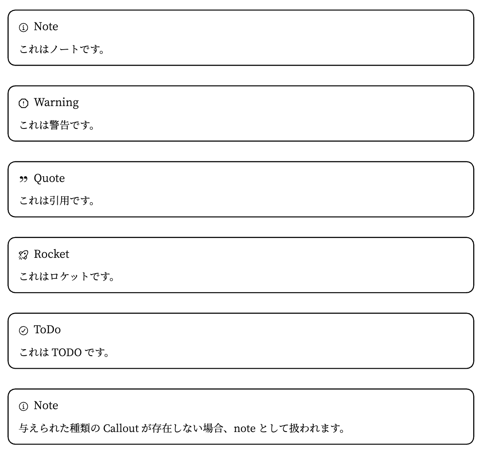
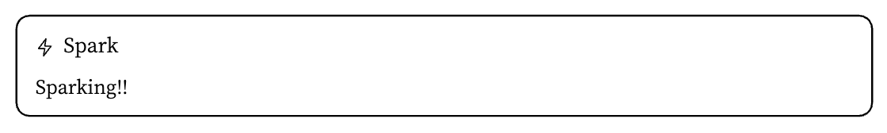

# Typst Templates

レポート作成用の、Typstのテンプレートです。

> [!IMPORTANT]
> サンプルPDF：[sample/sample-report.pdf](./sample/sample-report.pdf)

## 使い方

### フォントについて

デフォルトで、以下のフォントを使用しています。

- 見出し: [Noto Sans JP](https://fonts.google.com/specimen/Noto+Sans+JP)
- 本文: [Noto Serif JP](https://fonts.google.com/specimen/Noto+Serif+JP)
- 等幅: [UDEV Gothic NFLG](https://github.com/yuru7/udev-gothic)

### テンプレートのインストール

#### 自動インストール

このレポジトリをクローンして、このREADMEがあるディレクトリで以下のコマンドを実行してください。

```sh
deno run -A install.ts
```

#### 手動インストール

`./template.typ`をコピーして、レポートのファイルの先頭に以下のコードを追加することでも使用できます。

```typ
#import "./template.typ": report, code-info
#show: report.with(
  title: [
    #text(font: "Noto Emoji")[#emoji.crab] \
    計算機科学基礎実験 \
    第一回レポート \
    Rustによるプログラミング演習
  ],
  author: [
    IS科 \
    Rai
  ]
)
```

### テンプレートのアンインストール

```sh
# Linux
rm -rf ~/.local/share/typst/packages/local/jsreport

# MacOS
rm -rf ~/Library/Application Support/typst/packages/local/jsreport

# Windows
rm $env:APPDATA\typst\packages\local\jsreport
```

> <https://github.com/typst/packages#local-packages>

### テンプレートの使用

以下のコードを、レポートのファイルの先頭に追加してください。

```typ
#import "@local/jsreport:0.1.0": report, code-info
#show: report.with(
  title: [
    #text(font: "Noto Emoji")[#emoji.crab] \
    計算機科学基礎実験 \
    第一回レポート \
    Rustによるプログラミング演習
  ],
  author: [
    IS科 \
    Rai
  ]
)
```

> [!IMPORTANT]
> 詳しくは、[sample/sample-report.typ](./sample/sample-report.typ) を参照してください。

#### コードブロックについて

Typstでは、コードブロックに対して行番号の表示やキャプションの挿入、相互参照などをデフォルトではサポートしていません。したがって、このテンプレートではこれら機能を`#code-info()`関数を通して独自に実装しています。

`code-info`関数の定義は次の通りです：

```typ
#let code-info(
  caption: none,
  label: none,
  show-line-numbers: false,
  start-line: 1,
  highlight-line: ()
) = ...
```

- `caption`: コードブロックのキャプションを指定します。デフォルトでは、キャプションは表示されません。
- `label`: コードブロックにラベルを付けます。ラベルは、`#ref`関数を用いて参照することができます。
- `show-line-numbers`: 行番号を表示するか否かを指定します。デフォルトでは、行番号は表示されません。
- `start-line`: 行番号の開始番号を指定します。デフォルトでは、行番号は1から始まります。
- `highlight-line`: ハイライトする行番号のリストを指定します。デフォルトでは、ハイライトする行はありません。

`code-info`関数によって設定された情報は、その`code-info`関数が呼び出された次のコードブロックのみに適用されます。言い換えると、コードブロックの度に、`code-info`関数によって設定された情報はリセットされます。したがって、コードブロックに対して行番号の表示やキャプションの挿入、相互参照などを行う場合は、そのコードブロックの直前で`code-info`関数を呼び出す必要があります。

例えば、次のようにしてコードブロックを挿入することができます：

````typ
#import "@local/jsreport:0.1.0": code-info

プログラムを @code:fizzbuzz に示す。

#code-info(
  caption: "fizzbuzz.rs",
  label: "code:fizzbuzz",
  show-line-numbers: true,
  start-line: 1,
)
```rs
fn main() {
    for i in 1..=100 {
        if i % 15 == 0 {
            println!("FizzBuzz");
        } else if i % 3 == 0 {
            println!("Fizz");
        } else if i % 5 == 0 {
            println!("Buzz");
        } else {
            println!("{}", i);
        }
    }
}
```
````

#### フォントについて

- `heading-font`: 見出しのフォントを指定します。
  - type: `string`
  - default: `"Noto Sans JP"`
- `body-font`: 本文のフォントを指定します。
  - type: `string`
  - default: `"Noto Serif JP"`
- `mono-font`: 等幅のフォントを指定します。
  - type: `string`
  - default: `"UDEV Gothic NFLG"`
- `title-font`: タイトルのフォントを指定します。
  - type: `string`
  - default: `"Noto Serif JP"`

例えば、次のようにしてフォントを変更することができます：

```typ
#import "@local/jsreport:0.1.0": report

#show: report.with(
  heading-font: "Noto Sans JP",
  body-font: "Noto Serif JP",
  mono-font: "UDEV Gothic NFLG",
  title-font: "Noto Serif JP",
)
```

#### タイトルページについて

- `title`: タイトルを指定します。
  - type: `content`
  - default: `[タイトル]`
- `author`: 著者を指定します。
  - type: `content`
  - default: `[著者]`
- `date`: 日付を指定します。
  - type: `datetime`
  - default: `datetime.today()`
- `title-type`: タイトルの種類を指定します。
  - type: `"fullpage" | "inpage" | "none"`
    - `"fullpage"`: 1ページ目にタイトルページを挿入します。
    - `"inpage"`: 1ページ目の上部にタイトルを挿入します。
    - `"none"`: タイトルを挿入しません。
  - default: `"fullpage"`
- `title-component`: タイトルページのコンポーネントを指定します。コンポーネントは、以下のtypeを満たす関数です。
  - type: `(title: [タイトル], author: [著者], date: datetime.today(), font: "Noto Serif JP", gap: (32pt, 32pt)) => {}`
  - default: `report-title`

例えば、次のようにしてタイトルページを変更することができます：

```typ
#import "@local/jsreport:0.1.0": report

#show: report.with(
  title: [
    計算機科学基礎実験 \
    第一回レポート \
    Rustによるプログラミング演習
  ],
  author: [
    情報科学科 \
    ○○ ○○
  ],
  title-type: "inpage",
  date: datetime(
    year: 2023,
    month: 12,
    day: 3,
  ),
)
```

#### Callout について

```typ
#let callout(type, body) = ...
```

- type: Calloutの種類を指定する
  - type: "note" | "warning" | "quote" | "rocket" | "todo" | string
- body: Calloutの本文を指定する
  - type: `content`

##### Callout の描画

例えば、次のようにしてCalloutを挿入することができます：

```typ
#import "@local/jsreport:0.1.0": callout

#callout("note")[
  これはノートです。
]

#callout("warning")[
  これは警告です。
]

#callout("quote")[
  これは引用です。
]

#callout("rocket")[
  これはロケットです。
]

#callout("todo")[
  これはTODOです。
]

#callout("unknown")[
  与えられた種類のCalloutが存在しない場合、noteとして扱われます。
]
```



##### 新しい独自 Callout の作成

```typ
#import "@local/jsreport:0.1.0": callout, create-callout

#create-callout(
  "spark",
  (
    "Spark",
    image.decode("<svg width=\"15\" height=\"15\" viewBox=\"0 0 15 15\" fill=\"none\" xmlns=\"http://www.w3.org/2000/svg\"><path d=\"M8.69667 0.0403541C8.90859 0.131038 9.03106 0.354857 8.99316 0.582235L8.0902 6.00001H12.5C12.6893 6.00001 12.8625 6.10701 12.9472 6.27641C13.0319 6.4458 13.0136 6.6485 12.8999 6.80001L6.89997 14.8C6.76167 14.9844 6.51521 15.0503 6.30328 14.9597C6.09135 14.869 5.96888 14.6452 6.00678 14.4178L6.90974 9H2.49999C2.31061 9 2.13748 8.893 2.05278 8.72361C1.96809 8.55422 1.98636 8.35151 2.09999 8.2L8.09997 0.200038C8.23828 0.0156255 8.48474 -0.0503301 8.69667 0.0403541ZM3.49999 8.00001H7.49997C7.64695 8.00001 7.78648 8.06467 7.88148 8.17682C7.97648 8.28896 8.01733 8.43723 7.99317 8.5822L7.33027 12.5596L11.5 7.00001H7.49997C7.353 7.00001 7.21347 6.93534 7.11846 6.8232C7.02346 6.71105 6.98261 6.56279 7.00678 6.41781L7.66968 2.44042L3.49999 8.00001Z\" fill=\"currentColor\" fill-rule=\"evenodd\" clip-rule=\"evenodd\"></path></svg>")
  )
)

#callout("spark")[
  Sparking!!
]
```


